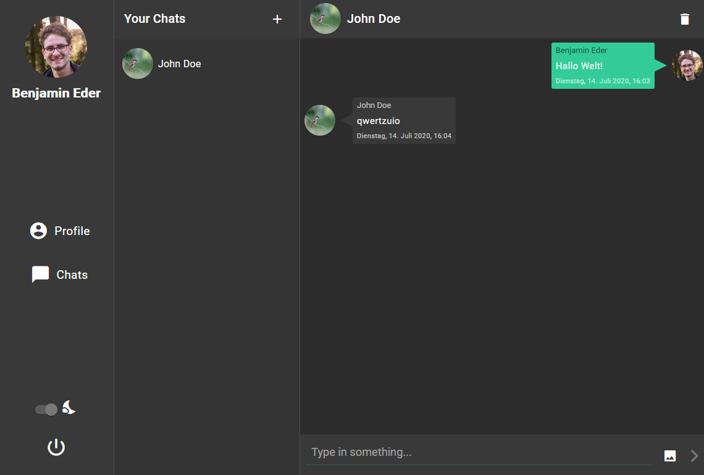

# Chat application

During the summer semester 2020 at the Munich university of applied sciences we (see license) implemented this chat web application.
It is based on the Spring framework, Angular and uses web sockets for communication.

